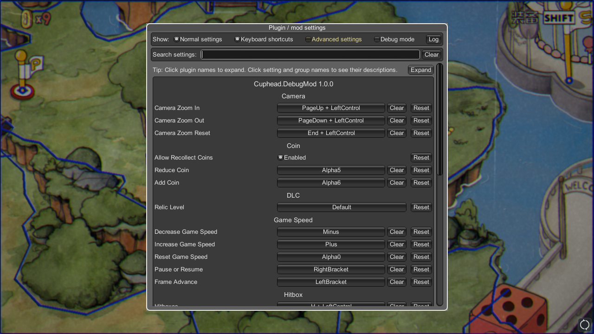
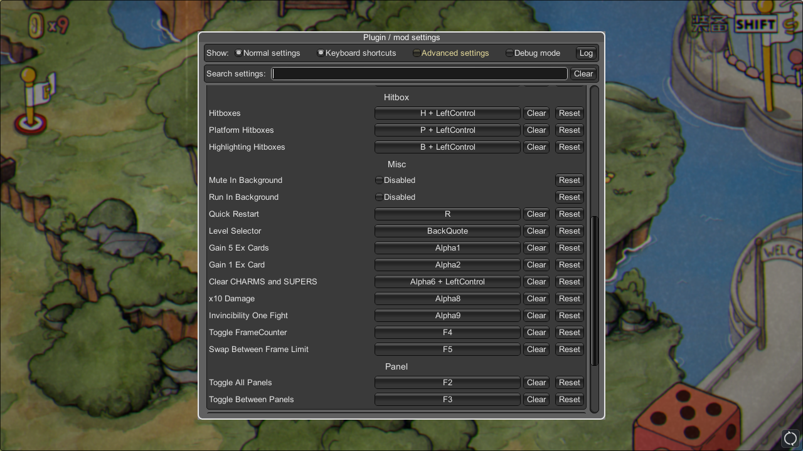

# Cuphead.DebugMod

Cuphead.DebugMod is a [BepInEx](https://github.com/BepInEx/BepInEx) plugin for practicing [Cuphead](https://store.steampowered.com/app/268910/Cuphead/), ported from the [Cuphead Speedruning discord](https://discord.gg/2BcMwEd)'s DebugMod and fixed some minor bugs, thanks to the original authors.

The original DebugMod is implemented by modifying Assembly-CSharp.dll,
which does not work with different versions and is not easy to maintain.
Porting to BepInEx avoids modifying the game files,
and benefits from the built-in config manager it is easy to change hotkeys and settings via the GUI

## Features
* Level Selector
* Quick Retry
* Info HUD
* Show Hitboxes
* Mute in Background
* Run in Background
* Tweak Game Speed
* Camera Zoom in/out
* etc...

## How to use
1. [Download](https://github.com/DemoJameson/Cuphead.DebugMod/releases) the zip then unzip all files into the game folder (the folder where Cuphead.exe/Cuphead.app is located).
2. (Windows) Run `Cuphead.exe` start the game with plugin. Run `Cuphead_Vanilla.bat` start the game without plugin.
3. (macOS) Launch `Terminal`, run `chmod +x run_bepinex.sh` (only once), then run `./run_bepinex.sh` start the game with plugin.
4. Press `F1` show settings.

## Credits
* [BepInEx](https://github.com/BepInEx/BepInEx)
* [BepInEx.ConfigurationManager](https://github.com/BepInEx/BepInEx.ConfigurationManager)
* [BepInEx.ScriptEngine](https://github.com/BepInEx/BepInEx.Debug#scriptengine)
* [BepInEx.NStrip](https://github.com/BepInEx/NStrip)
* [UnityExplorer](https://github.com/sinai-dev/UnityExplorer)
